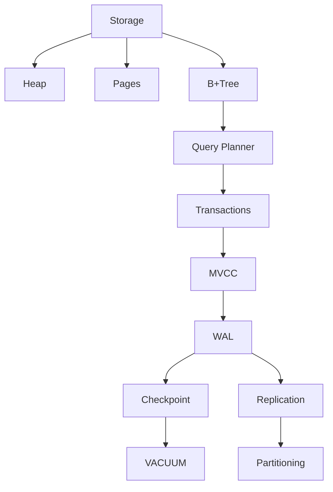

# PostgreSQL

## What is PostgreSQL?

PostgreSQL is a relational database designed for correctness, reliability, and complex querying. It provides ACID transactions, MVCC-based concurrency, and strong SQL support.

---

## Mental Map

---

## Read Path

Planner

↓

Index / Sequential Scan

↓

Heap

↓

Result

---

## Write Path

Planner

↓

B+Tree

↓

Heap

↓

Row Lock

↓

MVCC

↓

WAL

↓

Commit

↓

Checkpoint

↓

VACUUM

↓

Replication

---

## Scaling Strategy

Optimize Queries

↓

Indexes

↓

Vertical Scaling

↓

Read Replicas

↓

Partitioning

↓

Caching

↓

Sharding

↓

Distributed Database
